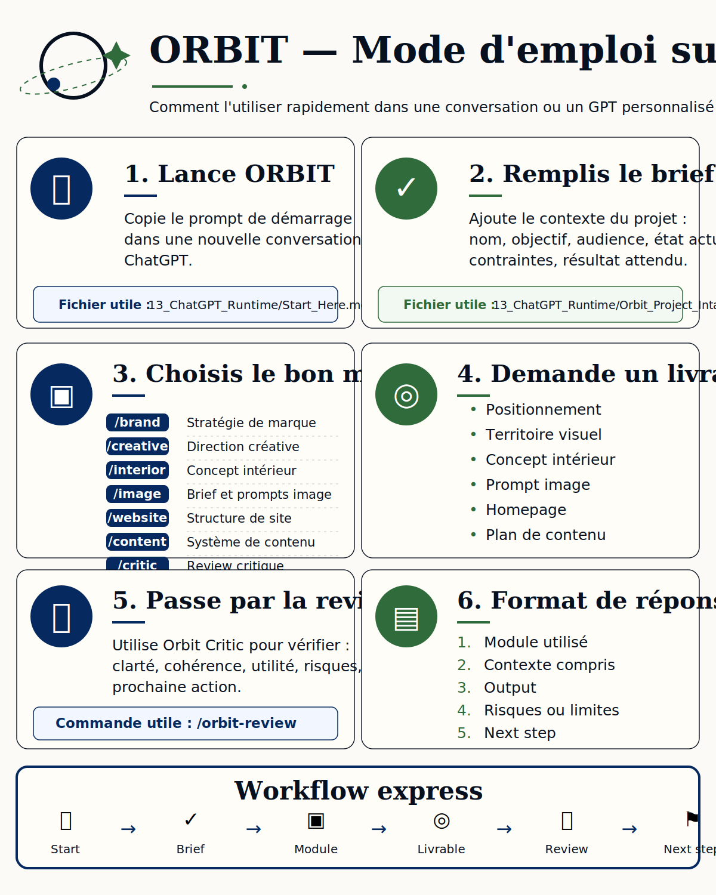

# Mode d'emploi visuel — ORBIT sur ChatGPT

## Aperçu

Ce visuel sert de fiche rapide pour utiliser ORBIT dans ChatGPT.

## Fichier image

`13_ChatGPT_Runtime/assets/mode_emploi_orbit_chatgpt.svg`

## Prévisualisation

## Usage recommandé

- lier ce fichier depuis le README principal
- l'utiliser dans la documentation runtime
- le conserver comme support visuel pour les utilisateurs

## Fichiers liés

- `13_ChatGPT_Runtime/Start_Here.md`
- `13_ChatGPT_Runtime/Orbit_Project_Intake.md`
- `13_ChatGPT_Runtime/Runtime_Commands.md`
- `13_ChatGPT_Runtime/Runtime_Quality_Gate.md`
